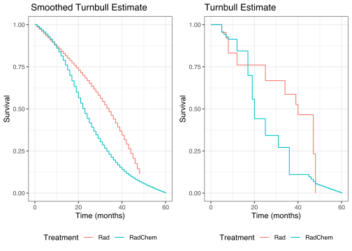

<!-- README.md is generated from README.Rmd. Please edit that file -->
<!-- badges: start -->
<!-- badges: end -->

# SISE

## Smoothed Interval-based Survival Estimation

The **SISE** package is used to estimate smoothed survival (and
time-to-event) distributions from interval-censored data, building on
the traditional Turnbull (1976) estimator. In a similar manner, our
method can also be used when observations are exact or right-censored
using a modification of the Kaplan-Meier (1958) procedure.

## Installation

You can install the **SISE** package with the following code.

``` r
# install.packages("devtools")
devtools::install_github("tubbsjd/SISE")
```

## Example

The main function from the **SISE** package is the `smoothTB()`
function. It takes a data frame or matrix of interval-censored
observations as input, where columns 1 and 2 are the left and right
interval bounds observed for each subject. For left-censored
observations, their value in column 1 should be `NA`. Likewise,
right-censored observations should have `NA` in column 2.

``` r
library(SISE)

#A quick example using the breast cosmesis data from the interval package
data(bcos, package = "interval")

#Get the data into the correct format
dat <- bcos[,1:2]
dat$left[dat$left == 0] <- NA
dat$right[is.infinite(dat$right)] <- NA

#Estimate the model in the two treatment groups using the logNe penalty for selecting a smoothing bandwidth.
results1 <- smoothTB(dat = dat[bcos$treatment == "Rad",], 
                     n.obs = 5, 
                     left.bound = 0, 
                     penalty=c('logNe'), 
                     n.dec = 0)
results2 <- smoothTB(dat = dat[bcos$treatment == "RadChem",],
                     n.obs = 5, 
                     left.bound = 0, 
                     penalty=c('logNe'), 
                     n.dec = 0)

#The results can be plotted and compared to the original Turnbull by extracting the survival estimates from the output.
library(ggplot2)
plt.df <- data.frame(Time = c(results1$time.s, results2$time.s),
                     Survival = c(results1$TB.s.smooth.logNe,
                                  results2$TB.s.smooth.logNe),
                     Treatment = factor(c(rep("Rad", length(results1$TB.s.smooth.logNe)),
                                          rep("RadChem", length(results2$TB.s.smooth.logNe)))))

p1 <- ggplot(plt.df, aes(x = Time, y = Survival, color = Treatment)) +
  geom_step() + theme_bw() + 
  labs(title = " Smoothed Turnbull Estimate", x = "Time (months)") +
  theme(legend.position = "bottom")

plt.df.tb <- data.frame(Time = c(results1$time.s, results2$time.s),
                     Survival = c(results1$TB.s, results2$TB.s),
                     Treatment = factor(c(rep("Rad", length(results1$TB.s)),
                                          rep("RadChem", length(results2$TB.s)))))

p2 <- ggplot(plt.df.tb, aes(x = Time, y = Survival, color = Treatment)) +
  geom_step() + theme_bw() + 
  labs(title = "Turnbull Estimate", x = "Time (months)") + 
  theme(legend.position = "bottom")

gridExtra::grid.arrange(p1,p2, nrow = 1)
```


